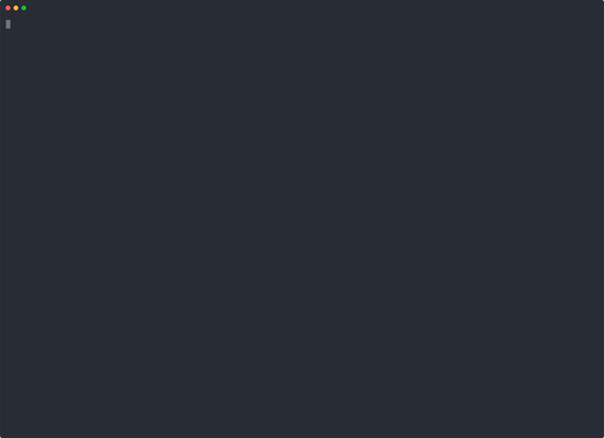

# Mars Rover Development Program

## Exercise Description

You’re part of the team that explores Mars by sending remotely controlled vehicles to the surface of the planet. To support this we will build a simulation program that we can use to test our rover AI and commands. For this exercise a Console application is sufficient. The program should support the exact interface as specified below. Invalid input should be rejected and communicated in a clear manner. No software exceptions or stack traces please!

For the simulation we will be using the cartesian coordinate system to keep things simple.

For a quick demonstration of what the initial application is all about you can watch this demo:

## Levels

The different requirements of the application are grouped into different levels. Depending on you experience and time, you can determine how far you want to take this ;) 

+ [Level one requirements](LEVEL-ONE.md) where we set up the basic simulation application.
+ [Level two requirements](LEVEL-TWO.md) where we implement the actual rover behaviour.
+ [Level three requirements](LEVEL-THREE.md) where we allow multiple Rovers.
+ [Level four requirements](LEVEL-FOUR.md) where we introduce time and program our rovers.

## The goal

The goal of the exercise is to display your skill, practices, approach to software development. 

+ How did you approach the problem, why did you choose this design over another design? 
+ Which practices did you use? Can your solution easily be modified? 
+ How hard would it be to add a real database or rich UI to it? 
+ How hard would it be to make a web application out of it?
+ Could it be split up in different deployables?

The goal of this exercise is NOT to make it work. Of course, it should work. That is the minimum requirement. But a small easily fixable bug in an easy modifiable system is less severe than flawless big ball of mud. 

Good luck and have Fun! :-)

